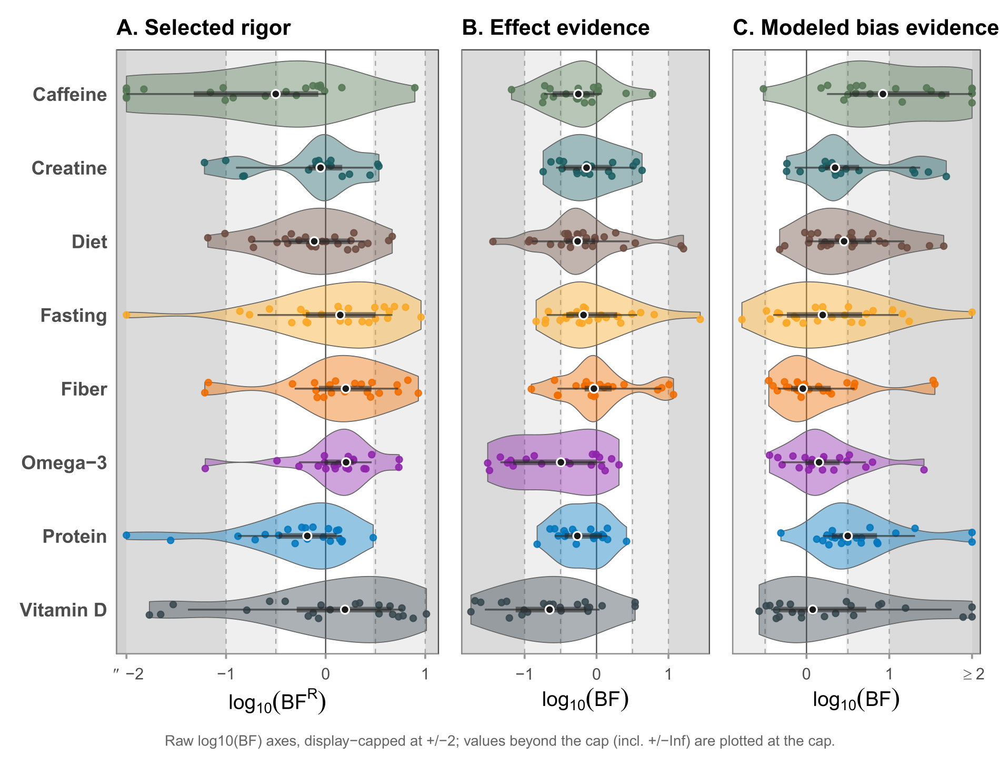

<!--
PROVENANCE — copied research assets on this page
  Source project : Evidential Audit Workflow (RoBMA-PSMA), Matt Hester
  Public repo    : https://github.com/matthewahester/evidential-audit-workflow
  Release        : v1.0.0 (2026-05-30); Zenodo DOI 10.5281/zenodo.20467258

  PUBLIC figures — from the v1.0.0 public release (MIT code / CC BY 4.0):
    output/caffeine/plots/caffeine_effect_estimate_comparison.pdf
      -> assets/examples/effect-comparison-caffeine.png
    output/caffeine/plots/caffeine_component_violin_stack.pdf
      -> assets/examples/component-violin-stack-caffeine.png
    output/overview/corpus_effect_attenuation_strip.pdf
      -> assets/examples/corpus-effect-attenuation-strip.png

  MANUSCRIPT figure — author Matt Hester; the selected-rigor / effect /
  modeled-bias version of corpus_component_violin_stack.pdf. This version
  is NOT in the public v1.0.0 / Zenodo release (the public repo's
  same-named file is a different effect/heterogeneity/bias composition).
  Used here with the author's permission; do NOT claim CC BY 4.0/Zenodo
  for this one.
    Rigor_Manuscript/05_artifacts/current/figures/corpus/corpus_component_violin_stack.pdf
      -> assets/examples/corpus-component-violin-stack.png

  Conversion : static PNG export of the source PDFs (not generated at
               site-render time); no R chunks execute on this page.
-->

This page collects a few **advanced showcases** — examples of finished,
real reproducible work that grew out of exactly the habits you practice
all term: write in source, render to output, keep things organized, and
let configuration (not hand-editing) build the result.

::: {.callout-important}
## These are showcases, not assignment models

- The figures and the website below are **finished, real projects**, shown
  to illustrate where the course's habits lead — **not** templates to copy
  for an assignment.
- The **exact requirements for any assignment live in the course LMS.**
- The research figures come from a **separate research project** by the
  course instructor (its open-source workflow is linked below). You are not
  expected to reproduce them; they are here so you can see professional
  reproducible output and recognize the same source → render → output ideas
  at a larger scale.
:::

## Why advanced showcases?

In the weekly work you build small things: a short math note, a first
`ggplot`, a tiny simulation, a tidy portfolio folder. It is easy to think
those habits stop being useful once the documents get bigger. They do not.
The same handful of habits — **plain-text source, render-to-output,
relative paths, organized folders, configuration over hand-editing** — are
what make large, trustworthy, reproducible projects possible. The
showcases below are real examples of that.

## Showcase 1 — Comparing baseline and bias-aware estimates

The same study can give a different answer depending on how carefully you
model it. The figure below compares each outcome's effect under a plain
**baseline** model with the same outcome under a **bias-aware** model;
each line connects the two estimates for one outcome. Many lines slope
toward zero — the bias-aware model **attenuates** (shrinks) effects that
the simpler model reported.

{#fig-effect-comparison fig-alt="Paired boxplot comparison of caffeine outcome effect sizes under a baseline model versus a bias-aware model, with most outcomes shrinking toward zero." width=70%}

The point for this course is not the statistics — it is that a **single
reproducible figure** can carry a real comparison, built from data by
code. A simplified sketch of the pattern:

```r
# Simplified from scripts/50_stratum_visuals.R (evidential-audit-workflow).
ggplot(estimates, aes(x = method, y = effect)) +
  geom_boxplot(aes(fill = method)) +
  geom_line(aes(group = outcome), color = "gray60") +   # one line per outcome
  geom_point() +
  geom_hline(yintercept = 0, linetype = "dashed") +
  labs(title = "Meta-analysis effect sizes — Caffeine",
       subtitle = "Baseline vs. bias-aware estimates",
       x = NULL, y = "Standardized effect size") +
  theme_minimal()
```

*Source: [evidential-audit-workflow](https://github.com/matthewahester/evidential-audit-workflow)
(`output/caffeine/plots/caffeine_effect_estimate_comparison.pdf`),
© Matt Hester, CC BY 4.0.*

## Showcase 2 — A multi-panel research figure

A single plot answers one question; a **multi-panel** figure puts several
related views side by side under one title so they can be read together.
The figure below stacks **three panels** — effect evidence, heterogeneity
evidence, and modeled-bias evidence — each a violin showing a distribution
of values across the same set of outcomes.

{#fig-violin-stack fig-alt="Three stacked violin panels (effect, heterogeneity, modeled bias evidence) for caffeine outcomes on a log Bayes-factor axis." width=80%}

Each panel is an ordinary `ggplot`; the three are **combined** into one
figure. That composition is itself reproducible — change the data and all
three panels update at once. A simplified sketch of one panel:

```r
# Simplified from scripts/50_stratum_visuals.R (evidential-audit-workflow).
# One component panel; the real figure stacks three (effect / het / bias).
ggplot(component, aes(x = log10BF, y = "")) +
  geom_violin(fill = "#4F9DCB", color = "gray40") +
  geom_jitter(height = 0.15, alpha = 0.8) +
  labs(title = "A. Effect evidence",
       x = expression(log[10](BF)), y = NULL) +
  theme_minimal()

# The panels A / B / C are then combined into one figure, e.g. with
# the patchwork package:   pA / pB / pC
```

*Source: [evidential-audit-workflow](https://github.com/matthewahester/evidential-audit-workflow)
(`output/caffeine/plots/caffeine_component_violin_stack.pdf`), © Matt
Hester, CC BY 4.0.*

## Showcase 3 — This website is a Quarto project

You do not have to leave the course to see a larger reproducible project —
**this website is one.** Every page you read here is a plain-text source
file that Quarto renders to HTML, organized into folders by purpose and
assembled by a configuration file. It is the same idea as a single
rendered document, scaled up to a whole site.

### The folder structure

```text
math-software/
├── _quarto.yml          # site configuration: navbar, sidebar, format
├── index.qmd            # the landing page
├── syllabus.qmd  schedule.qmd
├── notes/               # one .qmd per conceptual note (weeks 1–15)
├── labs/                # one .qmd per hands-on lab (1–9)
├── examples/            # this page lives here
├── resources/           # setup, data, AI, and CAS references
├── assets/              # images and figures
└── styles.css           # a little styling
#  _site/  .quarto/      # generated output + cache — never committed
```

Source files are **organized by purpose**, not dumped in one place — the
same habit you practice in your portfolio folder.

### Navigation is configuration, not magic

The sidebar and navbar are not hand-built on every page. They are
**declared once** in `_quarto.yml`, and Quarto applies them everywhere:

```yaml
website:
  title: "Intro to Mathematical Software"
  navbar:
    left:
      - href: index.qmd
        text: Home
      - href: syllabus.qmd
        text: Syllabus
  sidebar:
    contents:
      - section: "Notes"
        href: notes/index.qmd
        contents:
          - href: notes/week01-first-render.qmd
            text: "1 — Your first render"
          # … one entry per note …
      - section: "Labs"
        href: labs/index.qmd
        contents:
          - href: labs/lab01-install-stack.qmd
            text: "1 — Install the stack"
          # … one entry per lab …
```

### Pages are just source files

Each page is a `.qmd` with a small YAML header and ordinary prose —
exactly like the documents you write:

```markdown
---
title: "Your first render"
subtitle: "Week 1 — source files, rendered output, and the course container"
---

Every document in this course starts as a plain-text source file that you
render into a finished output …
```

### From source to a live site

The whole site is built the same way you render a single document:

```bash
quarto render        # turns every .qmd into HTML under _site/
```

Rendering produces a `_site/` folder of HTML. That generated output — and
the local `.quarto/` cache — are **deliberately not committed** to the
repository; only the **source** is tracked. A separate publishing step
takes the committed source, renders it, and deploys the result to the live
web address through a GitHub Pages workflow. Source in, website out.

### What makes this reproducible

- The site is **generated from source**, not hand-built page by page in a
  visual editor.
- **Navigation is configuration** in one file, not repeated on every page.
- **Generated and local files are ignored** — they are rebuilt from
  source, so they never clutter or bloat the repository.
- Anyone with the source can rebuild the entire site exactly.

## Culmination — Corpus-scale effect attenuation

The first two showcases looked at a single research area (caffeine). The
real payoff of a reproducible workflow is that the *same* code scales to
the *whole* project. This figure runs the baseline-vs-bias-aware
comparison across **every nutrition stratum at once** — eight areas in one
view — ordered so the patterns line up.

{#fig-corpus-attenuation fig-alt="Per-stratum paired boxplots comparing baseline and bias-aware effect sizes across eight nutrition strata, with estimates shrinking toward zero." width=90%}

Nobody arranged eight strata by hand. The figure is built from one tidy
table by code, so adding a stratum or revising the data redraws the whole
thing. A simplified sketch:

```r
# Simplified from scripts/70_corpus_visuals.R (evidential-audit-workflow).
ggplot(corpus, aes(x = stratum, y = effect, alpha = method)) +
  geom_boxplot(aes(fill = stratum), position = position_dodge(width = 0.7)) +
  geom_segment(aes(x = x_baseline, xend = x_bias,
                   y = mu_baseline, yend = mu_bias),
               color = "gray70") +                       # one line per outcome
  geom_hline(yintercept = 0, linetype = "dashed") +
  labs(title = "Meta-analysis effect sizes — Corpus (all strata)",
       x = NULL, y = "Standardized effect size") +
  theme_minimal()
```

*Source: [evidential-audit-workflow](https://github.com/matthewahester/evidential-audit-workflow)
(`output/overview/corpus_effect_attenuation_strip.pdf`), © Matt Hester,
CC BY 4.0.*

## Culmination — Corpus-scale evidence components

The multi-panel idea also scales to the whole corpus. This three-panel
figure shows three evidence components — **selected rigor**, **effect
evidence**, and **modeled-bias evidence** — for **every stratum**, so the
three views can be read together across the entire project.

{#fig-corpus-violin fig-alt="Three side-by-side panels (selected rigor, effect evidence, modeled bias evidence), each with one violin per nutrition stratum on a log Bayes-factor axis." width=95%}

It is the same composition habit as Showcase 2 — several ordinary plots
combined into one coherent figure — applied at corpus scale. A simplified
sketch of one panel:

```r
# Simplified from scripts/70_corpus_visuals.R.
# One component panel; the real figure places three side by side.
ggplot(corpus, aes(x = log10BF, y = stratum, fill = stratum)) +
  geom_violin(color = "gray40") +
  geom_jitter(height = 0.15, alpha = 0.8) +
  labs(title = "A. Selected rigor",
       x = expression(log[10](BF)), y = NULL) +
  theme_minimal()

# Panels A (selected rigor) / B (effect) / C (modeled bias) are combined
# side by side, e.g. with patchwork:  pA | pB | pC
```

*Source: a corpus-level figure from the instructor's evidential-rigor
research project, © Matt Hester. This selected-rigor / effect /
modeled-bias version is included here by the author as a teaching
showcase, and is not part of the public v1.0.0 / Zenodo release. The
related open-source workflow is public at
[evidential-audit-workflow](https://github.com/matthewahester/evidential-audit-workflow).*

## What students should take from these examples

- The habits scale. **Source → render → output** is the same whether the
  output is a one-page note or an entire website or a publication figure.
- **Code-built figures are reproducible figures.** Because the research
  figures above are produced from data by code, they can be regenerated
  exactly — which is what makes them trustworthy.
- **Organization and configuration** are not busywork; they are what let a
  project stay legible and rebuildable as it grows.
- You are already practicing all of this at small scale. These showcases
  are just the same ideas, grown up.

## Reminder

These are **advanced showcases**, not assignment models. Do not copy them
as submissions. The research figures come from the instructor's separate
research project — most from its public open-source release (CC BY 4.0),
and one from the associated manuscript, used with permission; the website
is this course site itself. The exact requirements for your own
assignments are in the course LMS.
