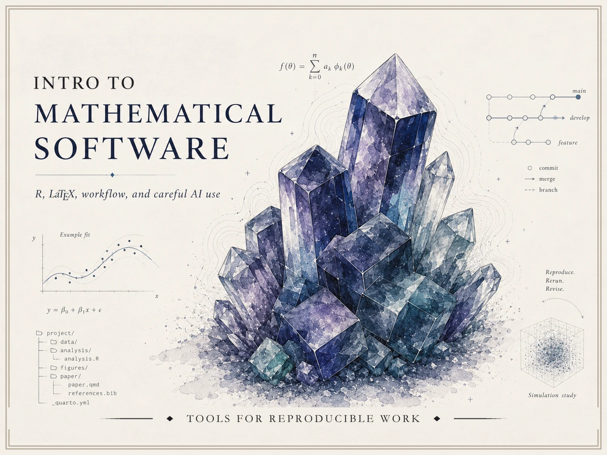

{fig-alt="Wide illustrated course identity image for Intro to Mathematical Software, showing a cool-toned crystal cluster surrounded by mathematical software, workflow, simulation, and version-control graphics." .course-hero-img}

# Intro to Mathematical Software {.course-landing-title}

This site collects public-facing resources for **Intro to Mathematical
Software** — a conference-based studio course in modern mathematical and
computational workflow: mathematical writing in LaTeX, computation and
visualization in R, reproducible Quarto projects, and the careful,
verified use of AI assistants. Curated by
[Matt Hester](https://matthewhester.com).

It is a **curated resource site**, not a raw course archive. Anything
section- or roster-specific lives in the course LMS; this site is
what stays public.

## Where to start

- [Syllabus](syllabus.qmd) — course identity, conferences, grading,
  and policies (sanitized for public view)
- [Schedule](schedule.qmd) — generic week-by-week topic map
- [Notes](notes/index.qmd) — short conceptual write-ups
- [Labs](labs/index.qmd) — step-by-step walkthroughs you can run on
  your own machine
- [Examples](examples/index.qmd) — small, reproducible code examples
- [Resources](resources/index.qmd) — software setup, AI guidelines,
  data guidelines, CAS options, and outside links

## What this course is about

Four interlocking pillars, woven together across the semester:

1. **LaTeX / mathematical writing** — typeset mathematics, theorem and
   proof blocks, figures, citations.
2. **R / computation, visualization, simulation, and reporting** —
   wrangle, plot, simulate, narrate.
3. **Technical workflow** — Quarto, project organization,
   reproducibility, portfolio building, optional light Git/GitHub.
4. **Responsible AI-assisted technical work** — disclosure,
   verification, revision, and critique.

The course is **AI-native, not AI-only**. AI assistants are legitimate
first-pass helpers for explanation, debugging, drafting, syntax
lookup, and workflow support. **Verification is the load-bearing
move:** accountability comes from rendered documents, executable code,
official documentation, reproducible organization, AI Use Notes, and
short instructor conferences — not from refusing AI on principle and
not from accepting AI uncritically.

## How the course meets

Scheduled Mon/Wed class times are reserved for the five **required
checkpoint conferences** (Weeks 1, 4, 7, 10, 13) plus optional
demonstrations, troubleshooting, and open studio. Ordinary scheduled
meetings are **not** required weekly lessons; the pacing comes from
**weekly deliverables**. The course LMS remains the operational home
for submissions, grades, announcements, due dates, and conference
sign-ups.

## What this course is not

It is **not** a survey of every mathematical software package. The
optional **[CAS options page](resources/cas-options.qmd)** points at
SageMath, WolframAlpha, Python + SymPy, MATLAB/Octave, and Maple for
the Week 13 optional second-tool exploration. **Public GitHub is
optional, never required**; portfolio organization is required but
public posting is not.
