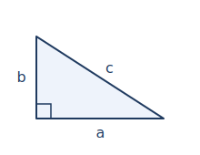

This lab walks through adding the **apparatus of a technical
document** — a figure, a table, and a citation, tied together with
automatic cross-references — to a short Quarto `.qmd`. It is the
practical companion to
[Figures, Tables, and References](../notes/week04-figures-tables-references.qmd),
the short conceptual reading for Week 4.

You should be comfortable with the Week 2–3 workflow: writing prose,
math, and structured statements in a `.qmd` and rendering to PDF.
Week 4 adds document parts, not a new toolchain — you stay in Quarto,
with no raw `.tex`, no `\documentclass`, and no bibliography package to
install. Quarto handles all of it.

## What you'll have at the end

- A new `hw04/` subfolder in your `math-software-portfolio/` containing
  **four files**: a `.qmd` source, a rendered `.pdf`, a
  `references.bib`, and one **image file** used as your figure.
- A short document that builds on your Week 3 structured writing and
  adds a **captioned figure**, a **captioned table**, a **citation**
  with an auto-generated **References** section, and at least one
  **automatic cross-reference**.
- A short **AI Use Note** in the standard three-line Tool / Purpose /
  Verification format (only required if you used AI assistance).

The exact assignment prompt, submission details, and the Week 4
checkpoint sign-up live in the **Assignments/LMS space**.

## 1. Create and open the Week 4 portfolio folder

Inside `math-software-portfolio/`, create `hw04/` next to your
existing `hw01/`, `hw02/`, and `hw03/`. From VS Code: **File → Open
Folder…** and pick `hw04/`. Opening the folder (not a single file)
keeps the Quarto extension, the file explorer, and the terminal all
working in the same place — which matters this week, because your
document, image, and `.bib` file all live together in this folder.

## 2. Start from a `.qmd` template

Create `week04-enriched.qmd` (a demo name for the walkthrough; the
graded file name lives in the **Assignments/LMS space**). Paste this
starter:

````markdown
---
title: "Week 4 — A short enriched technical document"
author: "YOUR NAME"
bibliography: references.bib
format:
  pdf: default
---

# Setup

A short paragraph of structured writing carried forward from Week 3 —
a claim and a brief justification, or a short worked exposition.

# Figure and table

# References
````

The new YAML line is `bibliography: references.bib` — it tells Quarto
where your sources live (you will create that file in step 7). The
`# References` heading is where the reference list will appear; Quarto
fills it in automatically.

## 3. Add an included-image figure

An image goes in your folder and is included with a **caption** and a
**label**. Here is a live example — a small right-triangle diagram that
ships with this lab:

{#fig-demo width=220}

As @fig-demo shows, an included image renders with its caption and an
automatic figure number. That figure came from a single line of
Markdown. In your own document you put **your** image file in `hw04/`
and adapt the same syntax:

````markdown
{#fig-setup}
````

- The text in `[ ... ]` is the **caption**.
- `figure.png` is the **image file name** — it must match your file
  exactly (including capitalization and extension).
- `{#fig-setup}` is the **label**. A figure label must start with
  `fig-`.

**Use your own image.** The triangle above is just a demo. Replace it
with a diagram, sketch, or photo you made; an image your instructor
provides; or an openly licensed image **with attribution** in the
caption. (No code-generated plots this week — those come with R
later.)

Render (see step 8) and confirm the image appears with its caption.

## 4. Refer to the figure with a cross-reference

In your prose, point at the figure with `@fig-setup`:

````markdown
The configuration is shown in @fig-setup.
````

When you render, `@fig-setup` becomes **"Figure 1"** with a link. Never
write "the figure below" — let the cross-reference number it for you.

## 5. Add a small captioned table

A Quarto table is a Markdown table with a caption line and a label
underneath it:

````markdown
| Quantity | Value |
|----------|-------|
| Width    | 3     |
| Height   | 4     |

: Measured quantities. {#tbl-data}
````

- The `: ...` line is the **caption**.
- `{#tbl-data}` is the **label**. A table label must start with `tbl-`.

Keep the table **small and readable** — a few rows and columns. A table
that overflows the page is a table to trim.

## 6. Refer to the table with a cross-reference

As with the figure, refer to the table by label:

````markdown
@tbl-data lists the measured quantities.
````

This renders as **"Table 1."** Here is a real, rendered example of a
captioned, cross-referenced table — @tbl-apparatus summarizes the
three Week 4 apparatus elements:

| Element  | Needs a caption? | Cross-reference prefix |
|----------|------------------|------------------------|
| Figure   | Yes              | `@fig-`                |
| Table    | Yes              | `@tbl-`                |
| Citation | Reference list   | `[@key]`               |

: The three Week 4 apparatus elements and how you refer to them. {#tbl-apparatus}

Notice that the sentence above shows "Table 1" where it says
@tbl-apparatus — the number is filled in for you.

## 7. Create `references.bib` and cite a source

Create a file named `references.bib` in `hw04/`. Add one **real**
source. A BibTeX entry looks like this (use the details of an actual
source you want to cite):

````bibtex
@article{eulerbridges,
  author  = {Euler, Leonhard},
  title   = {Solutio problematis ad geometriam situs pertinentis},
  journal = {Commentarii Academiae Scientiarum Petropolitanae},
  year    = {1741},
  volume  = {8},
  pages   = {128--140}
}
````

- `eulerbridges` is the **key** — a short name you choose.
- The fields (`author`, `title`, `journal`, `year`, …) describe the
  source.

Then cite it in your prose with the key in square brackets:

````markdown
This problem dates back to early graph theory [@eulerbridges].
````

When you render, `[@eulerbridges]` becomes an in-text citation and the
full reference appears automatically under your **References** heading.
You write the source once; Quarto formats and lists it.

## 8. Render to PDF

Render exactly as in earlier weeks. **Either method works:**

- **Preferred — Quarto: Preview.** Open the file, then press
  `Ctrl/Cmd + Shift + P` and run **Quarto: Preview**, or press
  `Ctrl/Cmd + Shift + K`. (If the Quarto extension shows a **Preview**
  button in the editor toolbar, that works too.)
- **Always works — terminal.** Open VS Code's integrated terminal
  (View → Terminal), make sure it is in the `hw04/` folder, then run:

  ```bash
  quarto render week04-enriched.qmd
  ```

If VS Code shows the file as **Plain Text** in the lower-right corner,
click it and choose **Quarto** (or **Markdown**), and confirm the
Quarto extension is installed. If the terminal says **"No valid input
files passed to render,"** the terminal is in the wrong folder or the
filename is misspelled.

## 9. Inspect the rendered PDF

Open the PDF and check the apparatus, one item at a time:

- **Figure.** The image appears (not a broken-image box) **and** has
  its caption.
- **Table.** It is readable, captioned, and does not overflow the page.
- **Cross-references resolve.** Every `@fig-`/`@tbl-` shows a number —
  **no `Figure ??` or `Table ??`** anywhere.
- **Citation renders.** The in-text `[@key]` shows a citation marker.
- **References section appears.** A reference list is at the end,
  listing your source.
- **The source is real.** This is the one no tool checks for you —
  confirm the source you cited actually exists.

Fix anything that is off in the source, then re-render.

## Common problems

Skim this before you start; come back when something breaks.

### `Figure ??` or `Table ??` in the PDF

- **Symptom.** A cross-reference shows `??` instead of a number.
- **Fix.** The reference and the label do not match. `@fig-setup` needs
  a figure labeled `{#fig-setup}`; `@tbl-data` needs a table labeled
  `{#tbl-data}`. Make them identical, and remember `fig-`/`tbl-`
  prefixes are required.

### The image does not appear

- **Symptom.** A broken-image box, or nothing where the figure should
  be.
- **Fix.** Check the file name and location. The image must be in the
  `hw04/` folder and the name in `` must match exactly,
  including capitalization and extension.

### No References section, or the citation shows as `[@key]`

- **Symptom.** The reference list is missing, or the literal `[@key]`
  appears in the PDF.
- **Fix.** Confirm `bibliography: references.bib` is in your YAML, that
  `references.bib` is in the same folder, and that the key in `[@key]`
  matches a key in the `.bib` file exactly.

### The `.bib` entry breaks the render

- **Symptom.** The render errors, or the reference silently does not
  appear.
- **Fix.** Check the entry for a missing comma between fields or an
  unmatched `{ }`. One malformed field can drop the whole entry.

### The table overflows the page

- **Symptom.** A wide table runs off the edge of the PDF.
- **Fix.** Trim columns or shorten cell contents. Week 4 tables should
  be small.

### A fabricated (AI-invented) citation

- **Symptom.** You asked an AI assistant for a reference, it gave you a
  perfectly formatted entry, and the source **does not exist**.
- **Fix.** Verify every source is real: find the actual paper or book,
  confirm the author and title, and confirm a DOI or link resolves.
  Record what you checked in your AI Use Note's **Verification** line. A
  fake citation is the most serious Week 4 mistake.

## Prepare for the Week 4 checkpoint

Week 4 includes a required **LaTeX checkpoint conference** — a short
conversation to confirm your skills are working and to help you pick a
realistic **LaTeX Project** (a short replication of an open-access
mathematics paper or excerpt). Come with **one candidate direction**:

- a candidate **open-access paper, excerpt, or topic**;
- one sentence on **why it is a reasonable scope** for a short paper;
- a note on **what part of it you might reproduce**.

Conference sign-up and timing are in the **Assignments/LMS space**.

## What this prepares you to do

When you finish this lab you should be able to:

- include an image as a captioned, labeled figure in a Quarto document;
- build a small captioned, labeled table;
- refer to figures and tables by automatic cross-reference, not "the
  figure below";
- keep sources in a `references.bib` file, cite one with `[@key]`, and
  produce an auto-generated References section;
- inspect a rendered PDF for apparatus problems — broken images,
  unresolved `??` cross-references, a missing reference list;
- use AI for syntax, captions, and `.bib` drafting while verifying that
  every cited source is real.

The Week 4 assignment in the course LMS uses exactly this workflow.
The course LMS holds the exact prompt, the file-naming convention, the
submission area, and the checkpoint sign-up.
